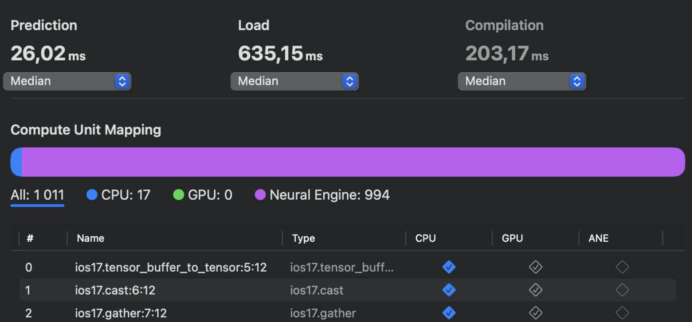
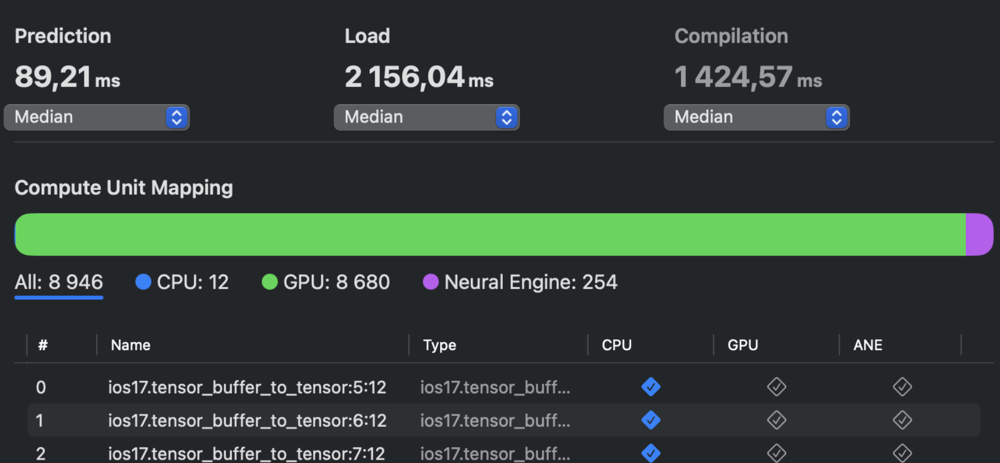
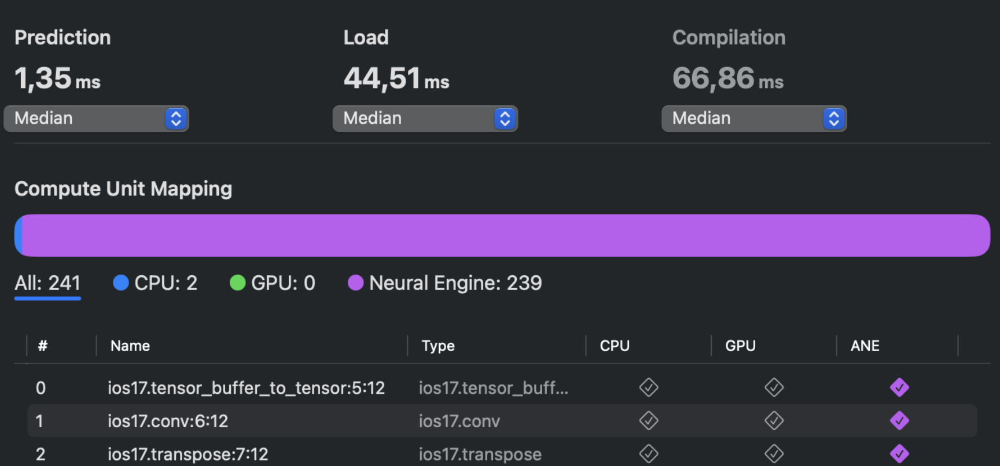

# ANE-Research

This is the project for the Architecture of the Computer Systems (ACS) course based on research of Apple Neural Engine. Our team performed an in-depth exploration of the Apple Neural Engine (ANE) as a key player in the on-device AI inference trend. The project is structured into three parts, each addressing specific aspects of ANE functionality, optimization, and potential contributions to the broader AI community. All information about the research is available in our report.

## ANE

Apple Neural Engine (ANE), also known simply as ANE, represents a type of Neural Processing Unit (NPU) comparable to a GPU. However, its focus is on accelerating neural network operations such as convolutions and matrix multiplications, rather than graphics.

## Tools & Utilities

- CoreML, an Apple framework to integrate machine learning models into the app. It provides a unified representation for all models.
- Conversion, happens using mainly the **CoreML Tools** Python package. Here are the detailed steps of a PyTorch ML model conversion:
  - Start with the PyTorch model we want to convert.
  - Use PyTorch’s JIT module to convert to a representation called TorchScript.
  - With a TorchScript model in hand, we will invoke the new Core ML converter to generate an ML model. The converter works by iterating over the operations in the TorchScript graph and converting them one by one to their Core ML equivalent. Sometimes one TorchScript operation might get converted into multiple Core ML operations. Other times, the graph optimization pass might detect a known pattern and fuse several operations into one.

## Stable Cascade

To help with the exploration of ANE, our team decided to convert the complex model that emerged earlier this year -- Stable Cascade.

Stable Cascade is a text-to-image model, which consists of three models: Stage A, Stage B and Stage C, representing a cascade to generate images, hence the name “Stable Cascade”. This architecture is called Würstchen, and it aims to learn extremely compact image representation that can guide the diffusion process.

The inference architecture consists of three stages, where the result of each stage is the input for the next one:

- Stage A is the decoder of Vector-Quantized Generative Adversarial Network (VQGAN) operating in the latent space (a compressed representation of the original data where each dimension corresponds to a specific feature or characteristic) with a compression ratio of 4:1.
- Stage B is the Latent Diffusion Model (LDM) generating the sample in the latent space of the VQGAN in Stage A, conditioned on the text and the latent representation from Stage C.
- Stage C is LDM that generates highly compressed latent representation sized in 16x24x24 (compression ratio of 42:1), conditioned on the text representation.

Stages A and B are used to compress images, similar to what the job of the Variational Autoencoder (VAE) is in Stable Diffusion. However, with this setup, a much higher compression of images can be achieved, as well as cheaper training and inference. Furthermore, Stage C is responsible for generating the small 24 x 24 latents given a text prompt.

## Conversion

The conversion generally consists of the same stages described earlier. However, as a result, 4 essential models are obtained after Stable Cascade conversion: text-encoder, decoder, prior and VQGAN. There are two pipelines from which we can get all necessary models: StableCascadePriorPipeline and StableCascadeDecoderPipeline.

- StableCascadePriorPipeline consists of exactly prior, text-encoder and other auxiliary parameters. This pipeline is meant to be used with the Stage C model, which operates on the small 24 x 24 latents and denoise the latents conditioned on text prompts.

- The Stage B and Stage A models are used with the StableCascadeDecoderPipeline (consisting of decoder, text-encoder, VQGAN and other auxiliary parameters) and are responsible for generating the final image given the small 24 x 24 latents.

For convenience, we utilized a pipeline that consolidates all previously mentioned components -- StableCascadeCombinedPipeline.

## Performance report

### Text encoder

The report offers an insightful overview of each layer within the text encoder. The majority of operations are efficiently handled by ANE, with only a small portion being processed by the CPU.

### Decoder

For the decoder the situation is completely different: the bulk of layer operations are offloaded to the GPU for computation, with the ANE handling only 254 layers, compared to the GPU's 8946. The primary assumption behind this performance is that the 'decoder' component of the Stable Cascade, along with the 'prior', is highly complex. Therefore, most operations cannot be offloaded to the ANE, and optimizing it would necessitate a complete overhaul of the model.

### VQGAN

Lastly, VQGAN's performance is highly optimized. Only 2 layer operations are handled by the CPU, while the remaining 239 are efficiently processed by the ANE.

## Optimizations and future endeavors

There are several ways to compress model weights. The first way is to store them more efficiently using a sparse matrix representation. This can be achieved by using a technique called pruning. Another way is to reduce the precision used to store the weights. This can be achieved by both quantization and palettization. However, both strategies are lossy, and generally less accurate than their uncompressed counterparts.

### Pruning

Helps to store model weights efficiently by representing them as a sparse matrix. Pruning means setting some of the weights to $0$. This means that only non-zero values need to be stored. This saves about 2 bytes of memory for each $0$ value entered. (Of course, you will also need to store the location of the zeros to reconstruct the matrix later.)

### Quantization

The second method of compressing weights, which uses 8-bit precision to store weights. To perform quantization, you modify the weights (scale, shift, and round them) so that they fall within the INT8 range.

### Palettization

To reduce the accuracy of the scales below 8 bits, you can use a technique called weight clustering or palettization. In this technique, weights with similar values are grouped and represented using the value of the center of the cluster to which they belong. These cluster centers are stored in a lookup table. And the original weight matrix is transformed into an index table where each element points to the corresponding cluster center.
